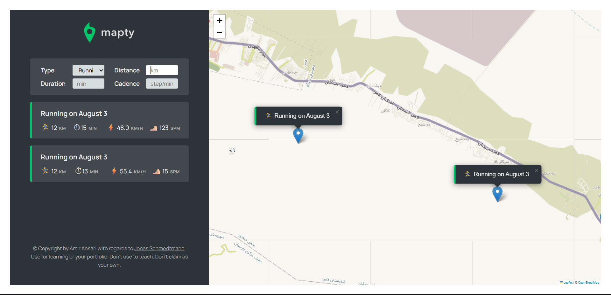

# 🗺️ Mapty – Workout Tracker Web App

Mapty is an innovative web application designed to help you track and visualize your workouts in real time. Whether you're a runner or a cyclist, Mapty lets you log your exercise sessions directly on an interactive map. It's a sleek, responsive, and intuitive app built using **JavaScript**, **HTML**, **CSS**, and the **Leaflet.js** mapping library.

## 🚀 Features

- Log running and cycling workouts
- View workout locations on a dynamic map
- Automatically calculate distance, duration, pace, and speed
- Pan to workout locations on map click
- Store data locally using the browser’s localStorage
- Clean, mobile-friendly user interface

## 🌐 Technologies Used

- **HTML5**
- **CSS3**
- **Vanilla JavaScript (ES6+)**
- **Leaflet.js** – for interactive maps
- **localStorage API** – for saving workouts

## 📸 Screenshot



## 🔗 Live Demo

👉 [Click here to view the live app](https://mapty-exercise-app.netlify.app)

## 📁 How to Run Locally

1. Clone the repository:

   ```bash
   git clone https://github.com/amirreza-ansari/Mapty.git
   ```
